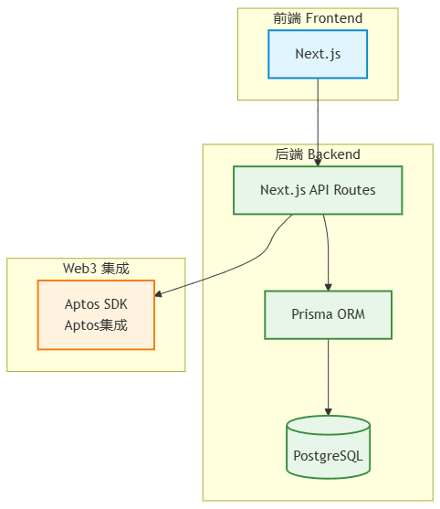

# Move to Learn Next

一个基于 Next.js 的全栈 Web3 学习平台。

## 技术架构

### 架构概览



该项目采用现代化的三层架构设计：

#### 1. 前端层 (Frontend)
- **核心框架**: Next.js 15.x
- **特点**：
  - 服务端渲染 (SSR) 支持
  - App Router 和 Pages Router 混合架构
  - TypeScript 类型支持
  - Tailwind CSS 样式解决方案

#### 2. 后端层 (Backend)
- **API 服务**: Next.js API Routes
- **数据持久化**:
  - Prisma ORM 数据库操作
  - PostgreSQL 关系型数据库
- **特点**：
  - 类型安全的数据库操作
  - 自动化的数据迁移
  - 灵活的数据模型定义

#### 3. Web3 集成层
- **以太坊集成**:
  - Wagmi/Viem 用于以太坊交互
  - RainbowKit 钱包连接
- **Aptos 集成**:
  - Aptos SDK 用于 Aptos 链交互

### 主要功能

1. **用户系统**
   - Web3 钱包登录
   - 用户信息管理

2. **学习平台**
   - 教育培训资料
   - AI 辅助学习
   - Move 语言操场

3. **后台管理**
   - 内容管理
   - 用户管理

### 技术特点

1. **现代化开发体验**
   - TypeScript 保证类型安全
   - ESLint 代码规范
   - pnpm 包管理

2. **高性能**
   - 服务端渲染优化
   - 自动静态优化
   - 智能数据缓存

3. **可扩展性**
   - 模块化架构
   - 清晰的代码组织
   - 完善的开发工具链

### 开发环境要求

- Node.js 18+
- PostgreSQL 14+
- pnpm 8+

### 快速开始

1. 克隆项目
```bash
git clone [repository-url]
```

2. 安装依赖
```bash
pnpm install
```

3. 环境配置
```bash
cp .env.example .env.local
```

4. 数据库设置
```bash
pnpm prisma migrate dev
pnpm prisma:seed
```

5. 启动开发服务器
```bash
pnpm dev
```

### 待办事项

- [x] 完成页面框架的搭建
- [x] 完成首页内容
- [x] 完成钱包登录功能
- [x] 完成后台功能
- [x] 完成教育培训资料内容的填充
- [x] 完成AI内容接入
- [x] 完成move操场

